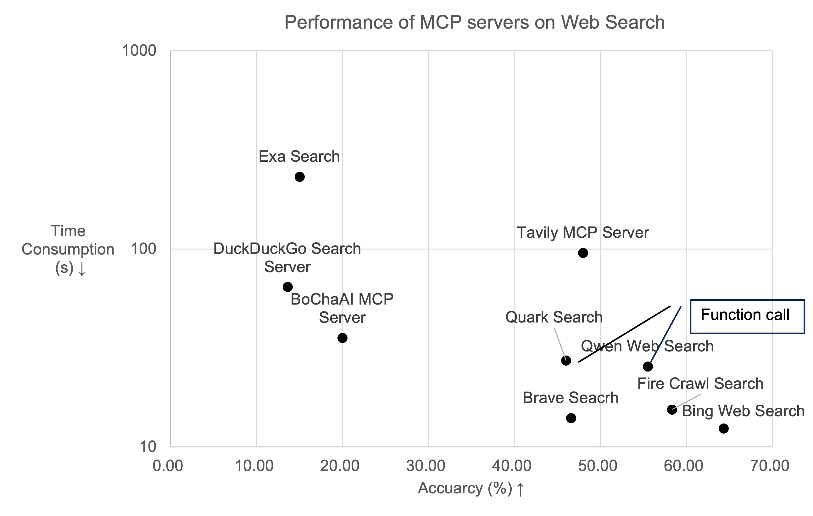

<h1 align="center">
	🦊 MCPBench: A Benchmark for Evaluating MCP Servers
</h1>


<div align="center">

[![Documentation][docs-image]][docs-url]
[![Package License][package-license-image]][package-license-url]

</div>

MCPBench is an evaluation framework for MCP Servers. It supports the evaluation of two types of servers: Web Search and Database Query, and is compatible with both local and remote MCP Servers. The framework primarily evaluates different MCP Servers (such as Brave Search, DuckDuckGo, etc.) in terms of task completion accuracy, latency, and token consumption under the same LLM and Agent configurations. Here is the [evaluation report](https://github.com/modelscope/MCPBench/blob/main/mcpbench.pdf).



The implementation is based on [LangProBe: a Language Programs Benchmark](https://arxiv.org/abs/2502.20315).

<hr>

<div align="center">
<h4 align="center">

[中文](https://github.com/modelscope/MCPBench/blob/main/README_zh.md) |
[English](https://github.com/modelscope/MCPBench/blob/main/README.md)

</h4>
</div>

# 📋 Table of Contents

- [🔥 News](#news)
- [🛠️ Installation](#installation)
- [🚀 Quick Start](#quick-start)
  - [LLM Configuration](#llm-configuration)
  - [Launch MCP Server](#launch-mcp-server)
  - [Launch Evaluation](#launch-evaluation)
- [🧂 Datasets and Experiments](#datasets-and-experiments)
- [🚰 Cite](#cite)

# 🔥 News
+ `Apr. 14, 2025` 🌟 We are proud to announce that MCPBench is now open-sourced.

# 🛠️ Installation
The framework requires Python version >= 3.11, nodejs and jq.

```bash
conda create -n mcpbench python=3.11 -y
conda activate mcpbench
pip install -r requirements.txt

```

# 🚀 Quick Start
## LLM Configuration
Prepare the LLM key and endpoint in your environment variables:
```bash
export MODEL_KEY=your_api_key_here
export MODEL_ENDPOINT=your_model_endpoint_here
```

## Launch MCP Server
### Launch stdio MCP as SSE
If the MCP does not support SSE, write the config like:
```json
{
  "name": "DuckDuckGo",
  "command": "uvx duckduckgo-mcp-server",
  "args": "",
  "port": 8001,
  "tool_name": "search",
  "tool_keyword": "query"
}
```

Save this config file in the `configs` folder and launch it using:

```bash
sh launch_mcp_as_sse.sh YOUR_CONFIG_FILE
```

For example, if the config file is duckduckgo.json, then run:
```bash
sh launch_mcp_as_sse.sh duckduckgo.json
```

### Launch SSE MCP
If your server supports SSE, you can use it directly. The URL will be http://localhost:8001/sse

For SSE-supported MCP Server, write the config like:
```json
{
  "name": "Exa Search",
  "command": "",
  "args": "",
  "url": "https://mcp-xxxx.api-inference.modelscope.cn/sse",
  "port": 0,
  "tool_name": "web_search",
  "tool_keyword": "query"
}
```
where the url can be generated from the MCP market on ModelScope.

## Launch Evaluation
To evaluate the MCP Server's performance on Web Search tasks:
```bash
sh evaluation_websearch.sh YOUR_CONFIG_FILE
```

To evaluate the MCP Server's performance on Database Query tasks:
```bash
sh evaluation_db.sh YOUR_CONFIG_FILE
```

# 🧂 Datasets and Experiments
Our framework provides two datasets for evaluation. For the WebSearch task, the dataset is located at `MCPBench/langProBe/WebSearch/data/frames_test.jsonl`, containing 200 QA pairs each from [Frames](https://arxiv.org/abs/2409.12941), news, and technology domains. Our framework for automatically constructing evaluation datasets will be open-sourced later.

For the Database Query task, the dataset is located at `MCPBench/langProBe/DB/data/car_bi.jsonl`. You can add your own dataset in the following format:

```json
{
  "unique_id": "",
  "Prompt": "",
  "Answer": ""
}
```

We have evaluated mainstream MCP Servers on both tasks. For detailed experimental results, please refer to [Documentation](https://github.com/modelscope/MCPBench/blob/main/mcpbench.pdf)

# 🚰 Cite
If you find this work useful, please consider citing our project:

```bibtex
@misc{mcpbench,
  title={MCPBench: A Benchmark for Evaluating MCP Servers},
  author={Zhiling Luo, Xiaorong Shi, Xuanrui Lin, Jinyang Gao},
  howpublished = {\url{https://github.com/modelscope/MCPBench}},
  year={2025}
}
```

[docs-image]: https://img.shields.io/badge/Documentation-EB3ECC
[docs-url]: https://github.com/modelscope/MCPBench/blob/main/mcpbench.pdf
[package-license-image]: https://img.shields.io/badge/License-Apache_2.0-blue.svg
[package-license-url]: https://github.com/modelscope/MCPBench/blob/main/LICENSE

